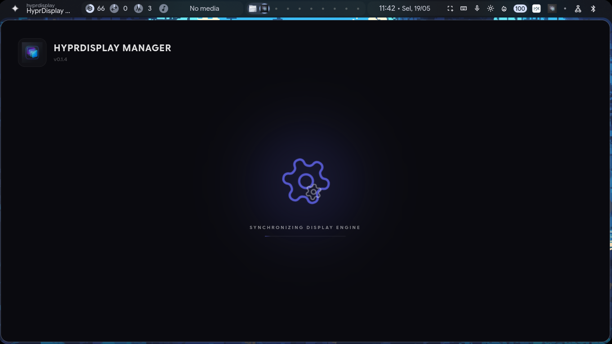
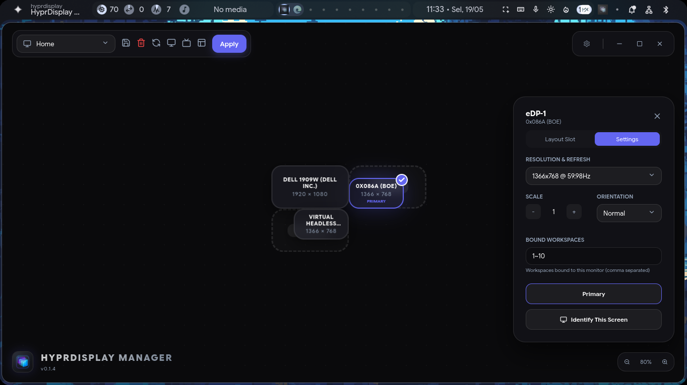
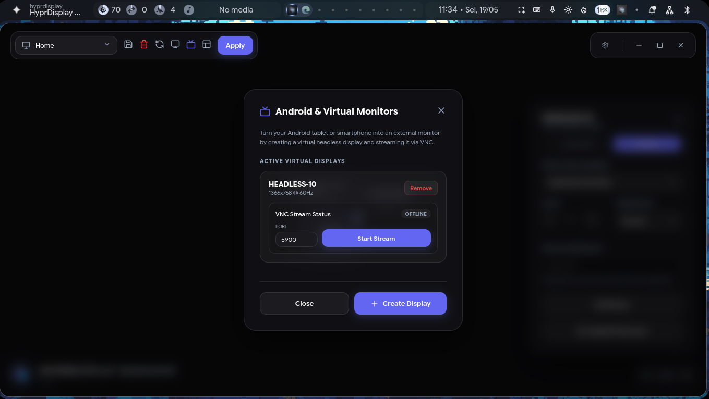
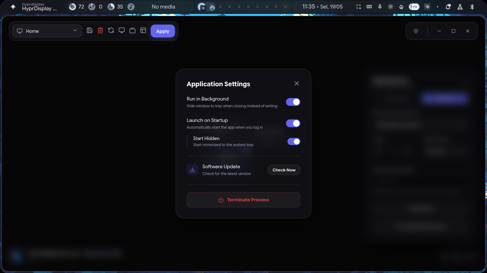
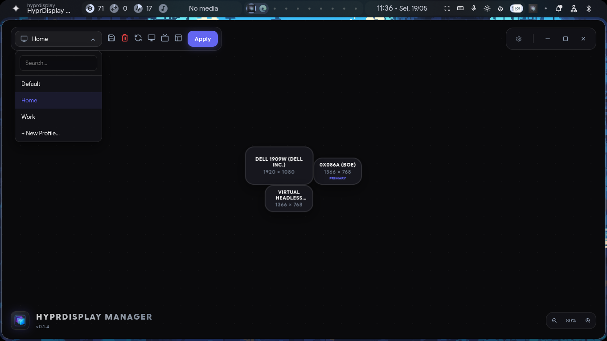
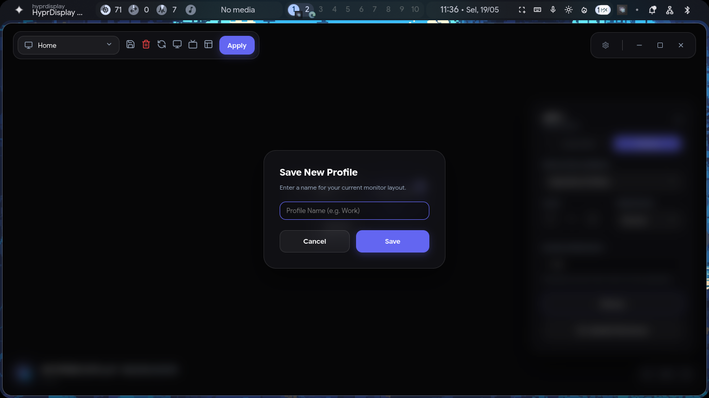

# 🖥️ HyprDisplay Manager


**HyprDisplay Manager** is a premium, high-performance GUI tool designed for **Hyprland** users to manage multi-monitor setups effortlessly. Built with **React**, **Electron**, and **Framer Motion**, it offers a seamless and visually stunning experience for configuring display layouts.

---

## ✨ Key Features

### 🎨 Premium User Experience
*   **Dynamic Splash Screen:** A high-tech initialization screen featuring a dynamic logo and rotating dual-gear animation, fully isolated to prevent side-effects during startup.
*   **Adaptive Toolbar Stack:** Intelligent header control toolbar that automatically stacks vertically and centers on small or split-screen windows to prevent visual collisions, and seamlessly returns to side-by-side rows in full-screen.
*   **Split-Screen Auto-Dismiss:** Active window resize listener that instantly closes the monitor editor panel when transitioning from a large screen to a narrow split-screen window, maximizing canvas space.
*   **Accidental Block Prevention:** Hides the editor panel on small screens by default to prevent it from blocking the canvas layout, providing a clean and responsive space.
*   **Modern Aesthetics:** Deep dark mode with glassmorphism effects, vibrant color harmony, and smooth hover micro-animations.
*   **Responsive UI:** Adapts gracefully to any window size, from compact mobile-width windows to widescreen setups.

### 📐 Powerful Layout Management
*   **Smart Layout Templates:** Instantly apply complex layouts:
    *   **Standard:** Triple horizontal or vertical stacks.
    *   **Dual Setup:** Side-by-side or stacked top-bottom configurations.
    *   **T-Shape:** Specialized 3-monitor layouts (Up, Down, Left, Right).
*   **Real-time Synchronization:** Directly modifies `~/.config/hypr/monitors.conf` and triggers `hyprctl reload` for instant display changes.
*   **Profile Persistence:** Save multiple configuration profiles and switch between them instantly.

### ⚙️ Advanced Settings
*   **Virtual & Android Monitors:** Seamlessly spawn virtual displays and stream them over VNC to mobile devices, with real-time connection status synchronization.
*   **Self-Healing Control Sockets:** Automated stale VNC control socket cleaning and unique socket bindings to prevent server crashes and multiple instance conflicts.
*   **System Integration:** Optional "Launch on Startup" and "Run in Background" (System Tray) support.
*   **Auto-Update Engine:** Built-in version tracking against GitHub releases to keep your engine up to date.

## 📸 Screenshots

<p align="center">
  <h3>✨ Dynamic Splash Screen</h3>
  

  <h3>🖥️ Main Dashboard (Canvas Layout)</h3>
  

  <h3>📱 Virtual Display & VNC Stream Settings</h3>
  

  <h3>⚙️ Application Settings</h3>
  

  <h3>📁 Profile Manager</h3>
  

  <h3>➕ Create New Profile</h3>
  
</p>

---

## 🚀 Installation

### Using AppImage (Recommended)
1.  Go to the [Releases](https://github.com/almerhal76/hyprdisplay/releases) page.
2.  Download the latest `hyprdisplay-x.x.x.AppImage`.
3.  Make the file executable:
    ```bash
    chmod +x hyprdisplay-*.AppImage
    ```
4.  Run the application:
    ```bash
    ./hyprdisplay-*.AppImage
    ```

### Development Setup
If you want to build from source:
```bash
# Clone the repository
git clone https://github.com/almerhal76/hyprdisplay.git

# Install dependencies
npm install

# Run in development mode
npm run dev

# Build for Linux
npm run build:linux
```

---

## 🛠️ Requirements
*   **Hyprland:** The application requires a running Hyprland session to manage displays.
*   **Linux OS:** Designed specifically for the Wayland-based Hyprland compositor.

---

## 📄 License
This project is licensed under the **MIT License** - see the [LICENSE](LICENSE) file for details.

---

## 🤝 Contributing
Contributions, issues, and feature requests are welcome! Feel free to check the [issues page](https://github.com/almerhal76/hyprdisplay/issues).

Developed with ❤️ for the Hyprland community.
